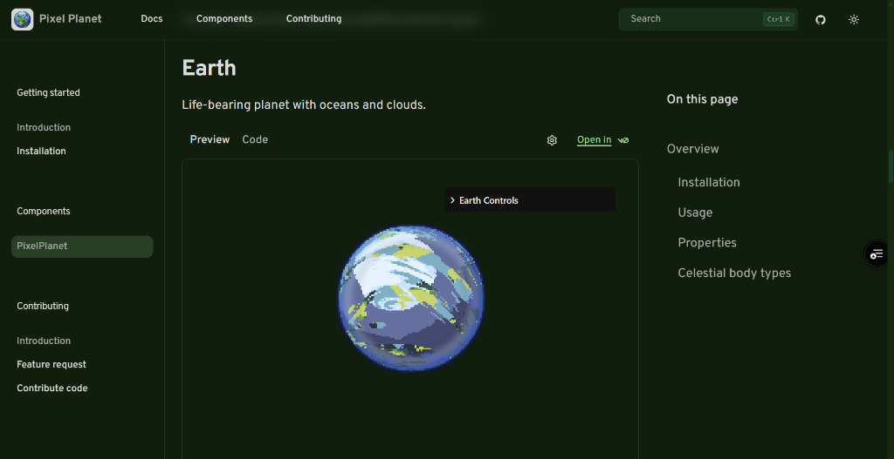

# Pixel Planet

A collection of accessible components built for use with Shadcn.

## Documentation

[](https://pixel-planet.fartlabs.org/components/pixel-planet)

Visit <https://pixel-planet.fartlabs.org/> to view the documentation.

## Contributing

Please read the [contributing guide](/CONTRIBUTING.md).

To start the documentation development server locally, run:

```bash
npm run dev
```

Before you commit, please ensure your code is properly formatted, linted, and the shadcn registry is built:

```bash
npm run format
npm run lint
npm run registry:build
```

## Acknowledgements

This project is built from the original source code and inspiration of [PixelPlanets](https://github.com/Timur310/PixelPlanets) by the original artist [**@Timur310**](https://github.com/Timur310).

This project is also based on the [shadcn registry template](https://github.com/WebDevSimplified/wds-shadcn-registry).

For a detailed walkthrough of how this registry was built, check out the tutorial: [How To Build Your Own Shadcn Registry](https://www.youtube.com/watch?v=2NV1w1m9cTY).

## License

Licensed under the [MIT license](/LICENSE).

---

Developed with 🧪 [**@FartLabs**](https://github.com/FartLabs)
